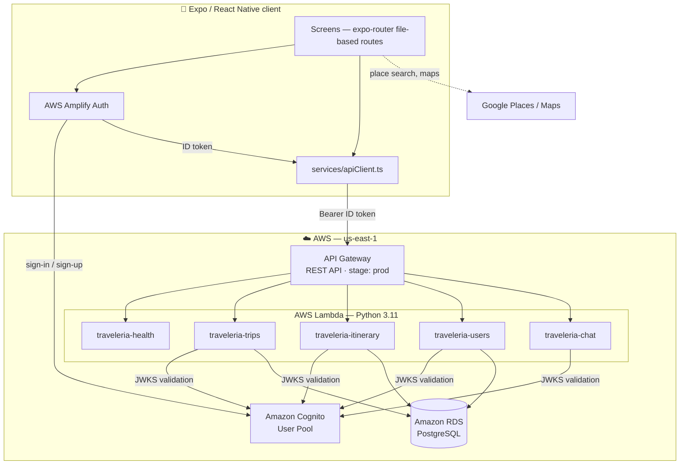
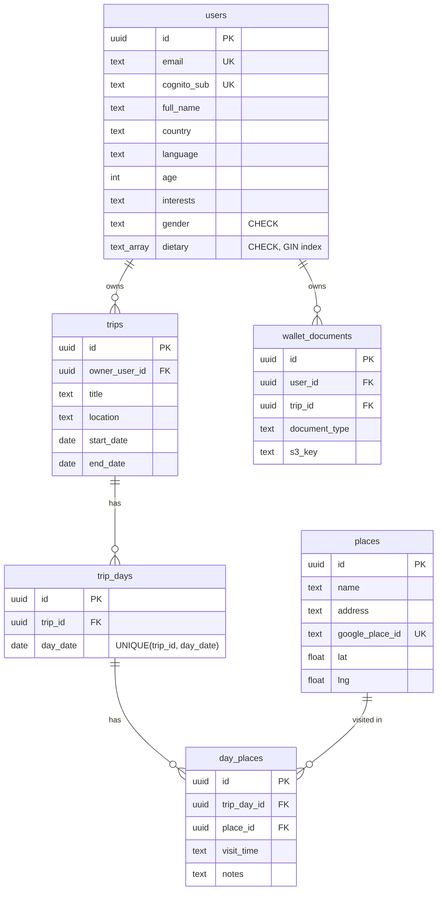

<div align="center">


**A mobile travel-planning app — plan trips, build day-by-day itineraries, keep your travel documents close, and share the journey.**

[](https://expo.dev)
[](https://reactnative.dev)
[](https://www.typescriptlang.org)
[](https://www.python.org)
[](https://aws.amazon.com/lambda/)
[](https://aws.amazon.com/rds/postgresql/)

</div>

---

## Overview

Traveleria runs on iOS, Android, and web. Create a trip, build a timed itinerary from Google Places and view it as a list or on a map, ask the in-app trip assistant, keep your travel documents in a wallet, and share the journey on a social feed.

It is built in three layers: an **Expo / React Native** client, five **Python AWS Lambda** functions behind a single **API Gateway** REST API, and **PostgreSQL on Amazon RDS**. Authentication is handled by **Amazon Cognito**; every API call carries a Cognito ID token that each Lambda validates independently.

---

## Features

| Area | What it does |
|---|---|
| **Auth** | Email + password sign-up with a Cognito verification code, persistent sessions, global sign-out, and account deletion. Every request carries the Cognito ID token. |
| **Trips** | Create a trip with a destination and a calendar-picked date range. Trips group into Upcoming / Past with relative badges (`Tomorrow`, `In 12 days`, `Ongoing`) and collapsed date ranges (`11-15 Aug 2026`). |
| **Itinerary** | Add, edit, and delete timed stops backed by Google Places Autocomplete, with notes. Switch between a chronological list and a map with a marker per stop. |
| **Trip assistant** | A chat panel per trip, served by the `/chat` Lambda — currently keyword-matched replies behind the final request/response contract. |
| **Wallet** | Apple-Wallet-style document cards: attach any file, preview it in-app, rename, recolour, delete. Stored on the device (`AsyncStorage`) in this build. |
| **Social** | Feed of posts with images, likes, comments, and threaded replies. Runs on in-memory mock data in this build. |
| **Profile** | Name, country, language, age, interests, gender, and dietary needs (a Postgres `TEXT[]` validated in the client, the Lambda, and a `CHECK` constraint). Avatar picker and server-side trip count. |
| **Theming** | Full light / dark / system theming from central design tokens, persisted across launches — including the map style. |

---

## Architecture



**Request lifecycle.** Amplify signs the user in and returns an ID token → `apiFetch()` attaches it as `Authorization: Bearer <token>` → API Gateway proxies the request to the Lambda for that route (**no authorization at the gateway**) → `shared/auth.get_current_user()` verifies the RS256 signature, issuer, and audience against the Cognito JWKS, rejects anything that is not an ID token, and upserts the user by `cognito_sub` → the handler queries scoped to that user's id.

**Design notes.** One Lambda per resource rather than per route — each branches on `httpMethod` (and `resource` for the nested itinerary paths). `shared/` is copied into every Lambda zip at build time, so there is no layer to keep in sync. Authorization lives in SQL: every query joins back to `trips.owner_user_id`, so a valid token still cannot reach another user's data.

---

## Repository layout

```
traveleria/                     # Expo / React Native client
├── app/                        # expo-router routes: login, signup, trip-details,
│   └── (tabs)/                 #   edit-profile, and the home/social/wallet/profile tabs
├── components/                 # AppButton, FormField, OptionSelector, DateRangePicker
├── config/awsConfig.ts         # Amplify Cognito configuration
├── constants/                  # design tokens, API URLs, map style, profile options
├── contexts/                   # ThemeContext, CurrentUserContext
├── services/                   # apiClient (token attachment), authService (Amplify)
├── utils/                      # validation rules, trip date formatting and grouping
├── app.json                    # Expo config, EAS project, update URL
└── eas.json                    # build profiles: preview / production

traveleria-backend/             # Python AWS Lambda backend
├── lambdas/                    # health, trips, itinerary, users, chat — one handler each
├── shared/                     # auth (JWT + upsert), database, response, utils
├── sql/                        # idempotent, numbered schema migrations
├── scripts/init_db.py          # applies every sql/*.sql in order
└── deploy_cloudshell.sh        # full AWS CloudShell provisioning (see warning below)
```

---

## Tech stack

| Layer | Technology |
|---|---|
| **Client** | React Native 0.81, Expo SDK 54, TypeScript 5.9 (strict), Expo Router 6, React 19 |
| **UI / maps** | Design-token system, Inter, React Navigation tabs, Reanimated, `react-native-maps`, Google Places Autocomplete |
| **Client auth** | AWS Amplify 6, `@react-native-async-storage/async-storage` for local state |
| **Backend** | Python 3.11 on AWS Lambda, `psycopg[binary]`, `PyJWT[crypto]`, `python-dotenv` |
| **Infrastructure** | API Gateway (REST, Lambda proxy), Amazon RDS PostgreSQL + `pgcrypto`, Amazon Cognito, EAS Build & Update |

---

## API reference

Base URL: `https://{api-id}.execute-api.us-east-1.amazonaws.com/prod` — all endpoints except `GET /` require `Authorization: Bearer <cognito-id-token>`.

| Method | Path | Lambda | Description |
|---|---|---|---|
| `GET` | `/` | `traveleria-health` | Health check. No auth. |
| `GET` | `/trips` | `traveleria-trips` | List the caller's trips, newest first. |
| `POST` | `/trips` | `traveleria-trips` | Create a trip. → `201` |
| `GET` | `/trips/{trip_id}/itinerary` | `traveleria-itinerary` | List stops, ordered by day then time. |
| `POST` | `/trips/{trip_id}/itinerary` | `traveleria-itinerary` | Add a stop. → `201` |
| `PUT` | `/trips/{trip_id}/itinerary/{event_id}` | `traveleria-itinerary` | Update a stop. |
| `DELETE` | `/trips/{trip_id}/itinerary/{event_id}` | `traveleria-itinerary` | Delete a stop and its place row. |
| `GET` | `/users/me` | `traveleria-users` | Profile + trip count. |
| `PATCH` | `/users/me` | `traveleria-users` | Partial profile update. |
| `POST` | `/chat` | `traveleria-chat` | Trip assistant reply. |

Trips are exchanged as `{"title", "location", "date": "DD.MM.YYYY - DD.MM.YYYY"}`; itinerary stops as `{"place", "address", "time": "HH:MM", "lat", "lng", "notes"}`. `PATCH /users/me` uses `COALESCE`, so an omitted field is left unchanged — though an empty `dietary` array does clear the selection. Errors come back uniformly as `{"detail": "<message>"}` with `400`, `401`, `404`, `405`, or `500`.

---

## Data model



`Trip → TripDay` (one per calendar day) `→ DayPlace` (a visit to a `Place` at a `visit_time` such as `"14:30"`). Primary keys are UUIDs from `pgcrypto`, serialized to strings before leaving the API. Deletes cascade down the trip hierarchy, except `day_places.place_id → places`, which is `RESTRICT` because `places` is a shared table.

Schema changes live in `traveleria-backend/sql/` as numbered files and are applied by `scripts/init_db.py`, which replays all of them on every run — so each statement must stay idempotent.

---

## AWS configuration

Everything runs in **`us-east-1`**.

### Amazon Cognito — identity

| Setting | Value |
|---|---|
| User Pool | `us-east-1_hxHdB32mE` |
| Sign-in | Email + password (`USER_PASSWORD_AUTH`) |
| Sign-up attributes | `email`, `given_name` |
| Confirmation | Emailed verification code |
| Token used by the API | **ID token** (RS256), validated against the pool's JWKS |

The client is configured in `traveleria/config/awsConfig.ts` and initialised once via `Amplify.configure()`. The backend derives the issuer and JWKS URL from `COGNITO_REGION` and `COGNITO_USER_POOL_ID`, and checks the `aud` claim against `COGNITO_APP_CLIENT_ID`.

### AWS Lambda — compute

| Setting | Value |
|---|---|
| Functions | `traveleria-health`, `traveleria-trips`, `traveleria-itinerary`, `traveleria-users`, `traveleria-chat` |
| Runtime | `python3.11`, handler `lambda_function.lambda_handler`, timeout 30 s |
| Execution role | `LabRole` |
| Environment | `DATABASE_URL`, `COGNITO_REGION`, `COGNITO_USER_POOL_ID`, `COGNITO_APP_CLIENT_ID` |

Dependencies are installed with `--platform manylinux2014_x86_64 --python-version 3.11 --only-binary=:all:` so the wheels match the Lambda runtime, then zipped with `shared/` and the function's handler.

### Amazon API Gateway — routing

| Setting | Value |
|---|---|
| API | `traveleria-api` (REST), stage `prod` |
| Integration | `AWS_PROXY` (Lambda proxy) |
| Authorization | `NONE` at the gateway — JWT validation happens inside each Lambda |
| CORS | `Access-Control-Allow-Origin: *`, set by the Lambda response helper |

```
/                                      → traveleria-health      (GET)
/trips                                 → traveleria-trips       (GET, POST)
/trips/{trip_id}/itinerary             → traveleria-itinerary   (GET, POST)
/trips/{trip_id}/itinerary/{event_id}  → traveleria-itinerary   (PUT, DELETE)
/users/me                              → traveleria-users       (GET, PATCH)
/chat                                  → traveleria-chat        (POST)
```

### Amazon RDS & S3 — storage

Managed PostgreSQL reached over the `postgresql://` connection string in `DATABASE_URL`; Lambdas open a short-lived connection per invocation through `shared/database.get_db()`, which commits on clean exit. The `wallet_documents.s3_key` column and the `EXPO_PUBLIC_WALLET_API_URL` client variable are in place for S3-backed wallet storage with per-user prefix isolation; that path is not wired up yet.

### EAS — builds and OTA updates

| Profile | Distribution | Android artifact | Update channel |
|---|---|---|---|
| `preview` | internal | APK | `preview` |
| `production` | store | AAB | `production` |

Runtime version follows the Expo SDK policy, and updates are served from `https://u.expo.dev/<projectId>`.

---

## Getting started

**Prerequisites:** Node.js 20+, Python 3.11+, access to the project's Cognito User Pool and RDS instance, and a Google Maps Platform key with the Places API and Maps SDK enabled.

### Backend

```bash
cd traveleria-backend
python -m venv .venv
source .venv/bin/activate        # Windows: .venv\Scripts\activate
pip install -r requirements.txt
cp .env.example .env             # then fill in the real values
python scripts/init_db.py        # applies every sql/*.sql — safe to re-run
```

The handlers are written against the API Gateway proxy event shape, so they run through AWS rather than a local server. For local work, point `EXPO_PUBLIC_API_URL` at an [ngrok](https://ngrok.com) tunnel.

### Frontend

```bash
cd traveleria
npm install
# create traveleria/.env with the keys listed under "Environment variables"
npm start
```

Then press `a` for Android, `i` for iOS, or `w` for web. Other scripts: `npm run android` / `ios` / `web`, `npm run lint`, and `npm run deploy` to publish an EAS Update.

---

## Environment variables

**`traveleria/.env`**

| Variable | Description |
|---|---|
| `EXPO_PUBLIC_API_URL` | Backend base URL — API Gateway stage URL, or an ngrok tunnel locally |
| `EXPO_PUBLIC_COGNITO_REGION` | Cognito region, e.g. `us-east-1` |
| `EXPO_PUBLIC_COGNITO_USER_POOL_ID` | Cognito User Pool id |
| `EXPO_PUBLIC_COGNITO_APP_CLIENT_ID` | Cognito app client id |
| `EXPO_PUBLIC_GOOGLE_PLACES_API_KEY` | Google Places / Maps key |
| `EXPO_PUBLIC_WALLET_API_URL` | Wallet document API endpoint (reserved) |

> `EXPO_PUBLIC_*` variables are inlined into the client bundle and are therefore not secret. Restrict the Google key by platform, bundle id, and API.

**`traveleria-backend/.env`** — `DATABASE_URL`, `COGNITO_REGION`, `COGNITO_USER_POOL_ID`, `COGNITO_APP_CLIENT_ID`. See `.env.example`. Both projects git-ignore `.env`.

---

## Deployment

### Backend

`deploy_cloudshell.sh` is a full, from-scratch provisioning run in AWS CloudShell: it builds one zip per Lambda, creates or updates all five functions, rebuilds the API Gateway resource tree, and deploys the `prod` stage.

> [!WARNING]
> **The script deletes and recreates the `traveleria-api` gateway, which produces a new API id and a new API URL.** Every installed client pointing at the old URL breaks until it is rebuilt. For a routine code change, update just the one function instead:
>
> ```bash
> aws lambda update-function-code --function-name traveleria-trips --zip-file fileb://zips/lambda_trips.zip --region us-east-1
> ```

### Frontend

```bash
eas build --profile preview --platform android      # internal APK
eas build --profile production --platform android   # store build
npm run deploy                                      # OTA JS update
```

OTA updates ship JavaScript and assets only — anything touching native code needs a fresh build.
